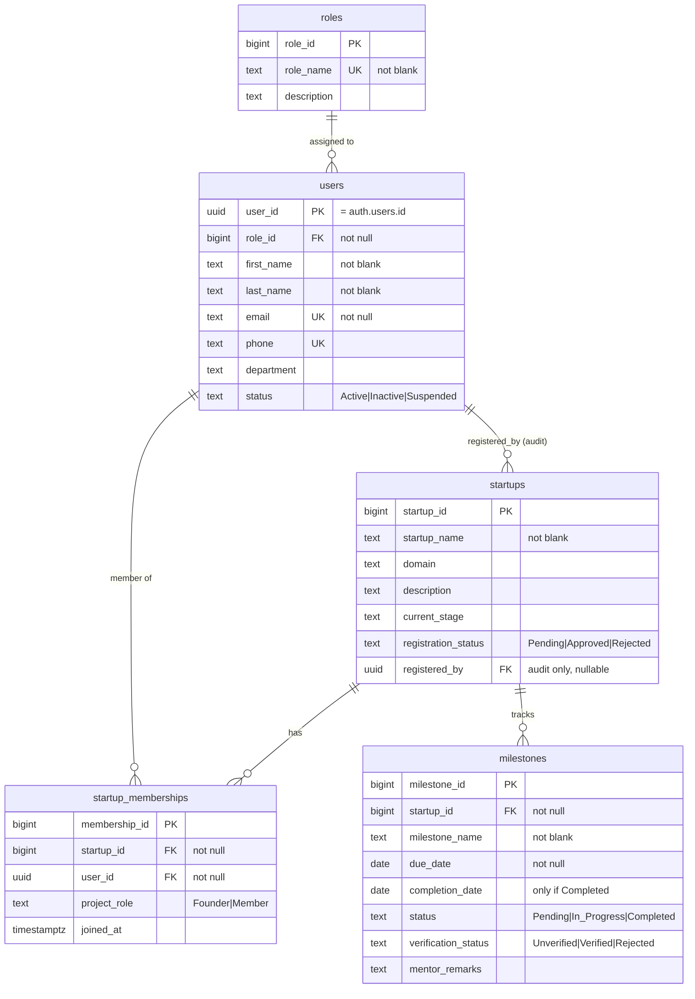

# Incubator — Core Module (database)

**Owner:** Harish · **Branch:** `mayuri_module` · **Status:** complete, applied to Supabase, 24/24 tests pass.

This module is the **5 core tables** every other module builds on:

```
roles ──1:N──> users ──1:N──> startup_memberships ──N:1──> startups ──1:N──> milestones
```

Mentoring / funding / demo-day modules are separate work — they FK to `users` and
`startups` and are **not** in this module.

---

## 1. The 5 tables (as built)



Every table also has `created_at` / `updated_at timestamptz`.

**Key design points**
- Table names plural + lowercase + unquoted; FK columns singular (`user_id`, `startup_id`).
- `users.user_id` **is** the Supabase Auth id (`auth.users.id`). No password column — Auth owns credentials.
- **System role** (`users.role_id` → Admin / Mentor / Founder / Judge, global) is a different
  thing from **project role** (`startup_memberships.project_role` → Founder / Member, per startup).
  A "Member" is a membership row, not a system role.
- A startup always has **≥ 1 founder** — enforced by `create_startup_with_founder()` +
  the `guard_last_founder` trigger (can't be a table constraint).

**Delete behaviour**

| Delete this | Effect |
|---|---|
| an `auth.users` account | its `users` profile → cascade |
| a `users` row | their memberships → cascade; `startups.registered_by` → set null |
| a `startups` row | its memberships + milestones → cascade |
| a `roles` row in use | blocked (restrict) |

---

## 2. How to run it

In the Supabase Dashboard → **SQL Editor**, paste and Run **in order**:

| # | File | Builds |
|---|------|--------|
| 00 | `migrations/00_reset.sql` | ⚠️ destructive — drops **every** table + function in `public`. Also delete the auth users in Dashboard → Authentication → Users. |
| 01 | `migrations/01_roles_users.sql` | `roles`, `users`, signup trigger |
| 02 | `migrations/02_startups_memberships.sql` | `startups`, `startup_memberships` |
| 03 | `migrations/03_milestones.sql` | `milestones` |
| 04 | `migrations/04_updated_at.sql` | 5 `updated_at` triggers |
| 05 | `migrations/05_seed.sql` | demo data (create the 5 auth users first — see file header) |
| 06 | `migrations/06_policies.sql` | RLS: 4 helper functions + 20 policies |
| 07 | `migrations/07_guards.sql` | 4 guard triggers |
| 08 | `migrations/08_functions.sql` | 8 business functions (RPC) |

Numbers `00`–`08` are reserved for this module. **Teammates start their scripts at `20_`**
(`20_mentoring.sql`, `30_funding.sql`, `40_demo_day.sql`) — coordinate exact numbers in the channel.

---

## 3. Business rules → where each is enforced

| # | Rule | Enforced by | Script |
|---|------|-------------|--------|
| 1 | One system role per user | `users.role_id` NOT NULL FK → `roles`; `role_name` UNIQUE | 01 |
| 2 | A startup has ≥ 1 founder, always | `create_startup_with_founder()` (atomic) + `guard_last_founder` trigger + `project_role` CHECK | 08, 07, 02 |
| 3 | A user can't be in the same startup twice | `UNIQUE (user_id, startup_id)` | 02 |
| 4 | Every membership → real user + startup | two NOT NULL FKs | 02 |
| 5 | Every milestone → exactly one startup | `startup_id` NOT NULL FK (cascade) | 03 |
| 6 | Founders manage their own startup | RLS policies + `is_startup_founder()` | 06 |
| 7 | Members are read-only | RLS: members appear only in `*_select`, never in write policies | 06 |
| 8 | No self-promotion | `guard_users_self_privilege` trigger; role changes only via `assign_user_role()` (Admin); signup trigger ignores client role | 07, 08, 01 |
| 9 | Milestone statuses controlled | CHECK lists + `guard_milestone_status_flow` (forward-only) + `guard_milestone_verification` (Mentor/Admin only) | 03, 07 |
| 10 | DB-level authorization | RLS enabled on all 5 tables + full per-command policy set; SECURITY DEFINER helpers with pinned `search_path` | 01–03, 06 |

---

## 4. Security model

- **RLS** (`06`) decides **which rows** a user can touch. 20 policies (SELECT/INSERT/UPDATE/DELETE × 5 tables), all `TO authenticated`.
- **Guard triggers** (`07`) decide **which column changes** are allowed:
  - `trg_users_guard_self_privilege` — can't change your own `role_id` / `status`
  - `trg_milestone_guard_verification` — only Mentor/Admin set `verification_status` / `mentor_remarks`
  - `trg_milestone_guard_status_flow` — milestone status only moves forward
  - `trg_memberships_guard_last_founder` — can't remove/demote a startup's last founder
- **Helper functions** (SECURITY DEFINER, bypass RLS to avoid recursion): `is_admin()`,
  `current_user_role()`, `is_startup_member(bigint)`, `is_startup_founder(bigint)`.

Access summary:

| table | SELECT | INSERT | UPDATE | DELETE |
|-------|--------|--------|--------|--------|
| roles | any logged-in | Admin | Admin | Admin |
| users | any logged-in | Admin (trigger creates on signup) | self or Admin | Admin |
| startups | members + Mentor + Admin | Founder/Admin (self as `registered_by`) | that startup's founders + Admin | founders + Admin |
| startup_memberships | own rows + co-members + Admin | founders + Admin | founders + Admin | founders + Admin |
| milestones | members + Mentor + Admin | founders + Admin | founders / Mentor / Admin | founders + Admin |

---

## 5. API reference

The database is exposed automatically by Supabase PostgREST. No API server is part of this module.

**Base URL** `https://sokelmntpysgtumwfoxq.supabase.co`
**Every request sends:**
```
apikey: <SUPABASE_ANON_KEY>
Authorization: Bearer <user access token>
```

### Auth (Supabase Auth — not our tables)
| Method | Path | Purpose |
|---|---|---|
| POST | `/auth/v1/signup` | email + password → creates `auth.users` row; our trigger creates the `users` profile (role = Founder) |
| POST | `/auth/v1/token?grant_type=password` | login → returns the access token used as the Bearer above |

### Tables — `/rest/v1/<table>` (all filtered by RLS above)
| Method | Path | Notes |
|---|---|---|
| GET | `/rest/v1/roles` `?select=*` | any logged-in user |
| GET | `/rest/v1/users` `?select=*&user_id=eq.<uuid>` | reads profiles |
| PATCH | `/rest/v1/users?user_id=eq.<uuid>` | your own row only (role/status blocked by trigger) |
| GET | `/rest/v1/startups` | only startups you're a member of (Mentor/Admin see all) |
| GET | `/rest/v1/startup_memberships` `?startup_id=eq.<id>` | your startups' rosters |
| GET | `/rest/v1/milestones` `?startup_id=eq.<id>` | your startups' milestones |
| PATCH | `/rest/v1/milestones?milestone_id=eq.<id>` | founders edit non-verification fields |

Prefer the RPCs below over direct writes for anything with a rule attached.

### Business operations — `POST /rest/v1/rpc/<function>` with a JSON body
| Function | Body | Who | Effect |
|---|---|---|---|
| `create_startup_with_founder` | `{ "p_startup_name": "...", "p_domain": "...", "p_description": "..." }` | Founder / Admin | creates the startup **and** the caller's founder row, atomically |
| `add_startup_member` | `{ "p_startup_id": 1, "p_user_id": "<uuid>", "p_project_role": "Member" }` | that startup's founder / Admin | add a member |
| `remove_startup_member` | `{ "p_startup_id": 1, "p_user_id": "<uuid>" }` | founder / Admin | remove a member (last founder blocked) |
| `promote_to_founder` | `{ "p_startup_id": 1, "p_user_id": "<uuid>" }` | founder / Admin | Member → Founder |
| `set_milestone_status` | `{ "p_milestone_id": 1, "p_new_status": "In_Progress" }` | founder / Admin | move status forward (auto-fills `completion_date` on Completed) |
| `verify_milestone` | `{ "p_milestone_id": 1, "p_verification": "Verified", "p_remarks": "..." }` | Mentor / Admin | set verification + remarks |
| `set_startup_status` | `{ "p_startup_id": 1, "p_status": "Approved" }` | Admin | approve / reject a startup |
| `assign_user_role` | `{ "p_user_id": "<uuid>", "p_role_name": "Mentor" }` | Admin | the only sanctioned way a system role changes |

Errors come back as HTTP 4xx with the message shown in the function (e.g. *"Only an Admin can approve or reject a startup."*).

---

## 6. Test evidence (Review 2)

All run in the SQL Editor on 2026-09-06 against the live project. **24/24 pass.**

### Access matrix — `tests/rls_test.sql`
| Block | Actor / action | Expected | Result |
|---|---|---|---|
| B1 | Sam (member) reads EcoTrack | 1 row | ✅ |
| B2 | Sam (member) updates EcoTrack | 0 rows changed | ✅ |
| B3 | Priya (founder) updates EcoTrack | 1 row changed | ✅ |
| B4 | Sam reads FinFlow (not a member) | 0 rows | ✅ |
| B5 | Admin counts all startups | 2 | ✅ |
| C1 | Priya sets her own role to Admin | error — rule 8 | ✅ |
| C2 | Priya sets a milestone's `verification_status` | error — rule 9 | ✅ |
| C3 | Mentor sets `verification_status` | 1 row changed | ✅ |
| C4 | Priya moves a Completed milestone back to Pending | error — forward-only | ✅ |
| D1 | Priya `create_startup_with_founder('NovaAI')` | startup + her founder row | ✅ |
| D2 | Sam `add_startup_member(...)` | error — not a founder | ✅ |
| D3 | Arjun removes himself as FinFlow's only founder | error — rule 2 | ✅ |
| D4 | Priya `set_startup_status('Approved')` | error — Admin only | ✅ |
| D5 | Admin `set_startup_status('Approved')` | status = Approved | ✅ |

### Constraint checks — `tests/negative_tests.sql` — every one must fail
| Block | Bad input | Rejected by |
|---|---|---|
| (a) | same user in a startup twice | `memberships_unique_user_per_startup` |
| (b) | `project_role = 'CEO'` | `memberships_project_role_check` |
| (c) | milestone with `startup_id = null` | NOT NULL on `startup_id` |
| (d) | `completion_date` set while status = Pending | `milestones_completion_needs_completed_status` |
| (e) | milestone `status = 'Done'` | `milestones_status_check` |
| (f) | duplicate milestone name in one startup | `milestones_unique_name_per_startup` |
| (g) | delete the `Admin` role while in use | FK violation on `users` |
| (h) | blank startup name | `startups_name_not_blank` |
| (i) | two users with the same email | `users_email_unique` |

**Demo (≈5 min):** show the ER diagram → run negative (a),(e),(g) → run rls_test B3, B2, B4, C1 →
run D1 and D3. The point: *the database blocks a Member, not the UI.*

---

## 7. Handover notes

### What's done
5 tables, 20 RLS policies, 4 helper functions, 4 guard triggers, 8 RPC functions, signup
trigger, `updated_at` automation, seed data — all applied to Supabase project
`sokelmntpysgtumwfoxq` and tested (section 6). Migration scripts `00`–`08` are in `migrations/`.

### The shared contract — do NOT duplicate
- FK your tables to `public.users(user_id)` (uuid) and `public.startups(startup_id)` (bigint).
- Column names in these 5 tables are **frozen**.
- Reuse the helper functions in your own RLS: `public.is_admin()`, `public.current_user_role()`,
  `public.is_startup_member(bigint)`, `public.is_startup_founder(bigint)`.
- Reuse `public.set_updated_at()` for your own `updated_at` triggers.

### Conventions to follow
Plural lowercase table names, singular FK columns, `created_at` / `updated_at` on every table,
RLS enabled from creation, every FK gets an explicit `ON DELETE`, one committed script before
anything touches the DB. Scripts numbered from `20_`.

### Next member's scope
- Add tables for **mentor assignment, funding requests, demo-day evaluation** (README says these
  aren't modelled yet). Same patterns as above.
- Extend the ER diagram in section 1 with the new entities.
- Document their new endpoints in section 5 (PostgREST auto-exposes them once RLS is set).

### Known, accepted trade-offs (not bugs)
- `users.email` has NOT NULL + UNIQUE but no not-blank CHECK, and no case-folding
  (`A@x.com` ≠ `a@x.com`).
- `milestones` allows `completion_date` earlier than `due_date`.
- `guard_milestone_status_flow` (07) has no "trusted context" bypass — even the service role
  can't move a milestone backwards. Intentional; noted for consistency.
- Rule 2 ("one *or more* founders") still wants a team sign-off.

### Test accounts
`admin@ mentor@ priya@ arjun@ sam@ test.com` — password `Test1234!`.
(admin = Admin, mentor = Mentor, the rest = Founder system role; in the seed Priya & Arjun are
EcoTrack co-founders, Sam is an EcoTrack member, Arjun is FinFlow's sole founder.)
